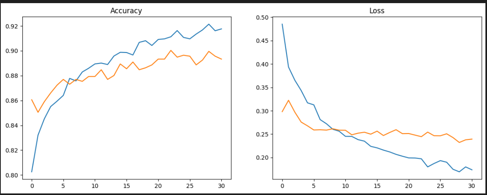

<!DOCTYPE html>
<html lang="en">

<body>

    <h1>🦷 Dental Disease Classification Model</h1>

    

        <h2>📌 Overview</h2>
        

            This project is a deep learning model designed to classify dental diseases
            from images using Transfer Learning with MobileNetV2.
        

    

    

        <h2>🧠 Classes</h2>
        <ul>
            <li>Calculus</li>
            <li>Gingivitis</li>
            <li>Mouth Ulcer</li>
            <li>Caries</li>
        </ul>
    

    

        <h2>⚙️ Technologies Used</h2>
        <ul>
            <li>Python</li>
            <li>TensorFlow / Keras</li>
            <li>MobileNetV2 (Transfer Learning)</li>
            <li>NumPy</li>
            <li>Matplotlib</li>
        </ul>
    

    

        <h2>📂 Dataset</h2>
        

            The dataset is automatically split into:
        

        <ul>
            <li>70% Training</li>
            <li>15% Validation</li>
            <li>15% Testing</li>
        </ul>
    

    

        <h2>🔄 Data Augmentation</h2>
        

            To improve generalization, the following techniques were applied:
        

        <ul>
            <li>Rotation</li>
            <li>Zoom</li>
            <li>Horizontal Flip</li>
            <li>Brightness Adjustment</li>
            <li>Shift & Shear Transformations</li>
        </ul>
    

    

        <h2>🏗️ Model Architecture</h2>
        <ul>
            <li>MobileNetV2 (Pretrained on ImageNet)</li>
            <li>Global Average Pooling</li>
            <li>Batch Normalization</li>
            <li>Dense Layers (512 → 256)</li>
            <li>Dropout for Regularization</li>
            <li>Softmax Output Layer</li>
        </ul>
    

    

        <h2>🚀 Training Strategy</h2>
        <ul>
            <li>Phase 1: Train classifier head</li>
            <li>Phase 2: Fine-tune top layers of MobileNetV2</li>
            <li>Optimizer: Adam</li>
            <li>Early Stopping applied</li>
        </ul>
    

    

        <h2>📊 Output</h2>
        <ul>
            <li>Trained model saved as <code>dental_v2.h5</code></li>
            <li>Accuracy vs Validation Accuracy graph</li>
        </ul>
    

    

        <h2>▶️ How to Run</h2>
        <ol>
            <li>Install dependencies:
                <code>pip install tensorflow numpy matplotlib</code>
            </li>
            <li>Prepare dataset inside the root directory</li>
            <li>Run the Python script</li>
        </ol>
    

    

        <h2>✨ Future Improvements</h2>
        <ul>
            <li>Deploy model in mobile app (Flutter)</li>
            <li>Improve dataset size</li>
            <li>Add more dental classes</li>
            <li>Use advanced architectures</li>
        </ul>
    

    

    <h2>📈 Training Performance</h2>
    

        The following graph shows the training and validation accuracy over epochs:
    

    

    

        <h2>👩‍💻 Author</h2>
        

            Developed by <b>Toka Ahmed</b>
        

    

</body>
</html>